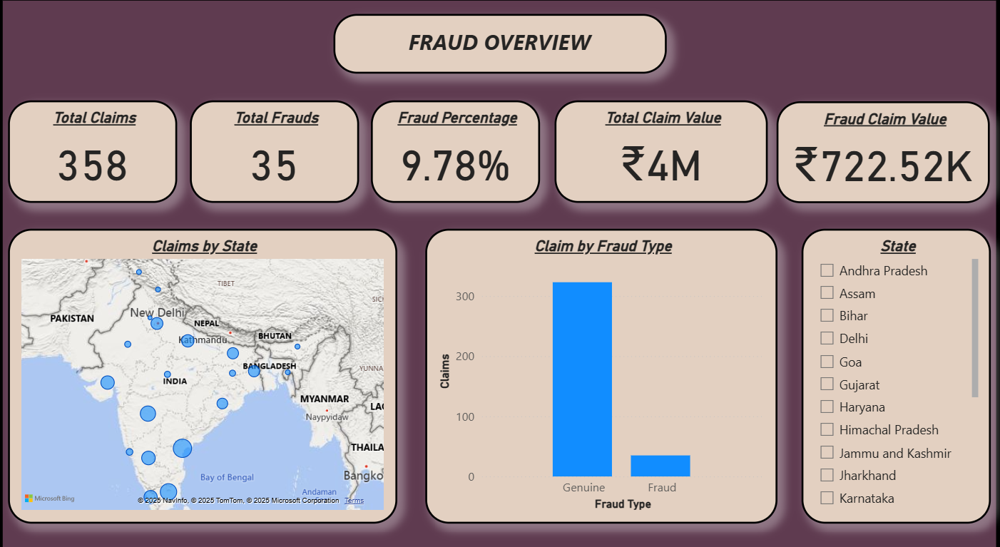
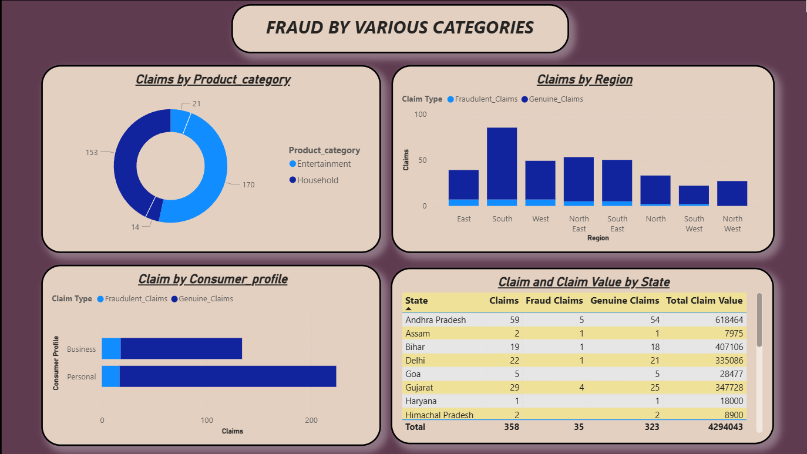
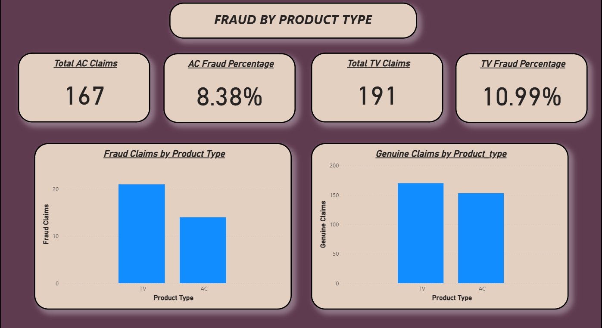

# 🧾 Warranty Claims Fraud Prediction

## 🧠 Introduction
This project focuses on predicting the authenticity of warranty claims using data-driven approaches. The dataset, sourced from **Kaggle**, contains **358 records with 21 features** capturing details such as region, product category, claim value, service center, and purchase source.  

The main objective is to classify warranty claims as **fraudulent (1)** or **genuine (0)**. Through **exploratory data analysis (EDA)** and machine learning techniques, this project aims to uncover fraud patterns and develop reliable predictive models to improve fraud detection efficiency.

🔍 The complete implementation, analysis, and visualizations are available in the Jupyter notebook file: **`Warranty Claims Fraud Prediction.ipynb`**

---

## ⚙️ Methodology
1. **Data Preprocessing**
   - Handled missing values and encoded categorical features.
   - Performed feature scaling and transformation for model compatibility.

2. **Exploratory Data Analysis (EDA)**
   - Analyzed geographical distribution of claims.
   - Investigated relationships between claim type, region, product type, and purchase source.

3. **Model Development**
   - Implemented three classifiers:  
     - Decision Tree Classifier  
     - Random Forest Classifier  
     - Logistic Regression  
   - Compared model accuracy, recall, and precision to identify optimal performance.

---

## 📊 Results
- **Accuracy:** 91–92% for all models.  
- **Fraudulent Claims Pattern:**
  - More common in **urban regions** (e.g., Hyderabad, Chennai).  
  - **Higher claim values** are often fraudulent.  
  - **Service Centre 13** reported the highest number of fraud cases.  
  - **Short customer call duration (< 3–4 minutes)** often correlates with fraudulent claims.  

- **Model Limitations:**
  - Due to limited fraudulent data, models had **low recall** for fraud detection.
  - Future improvements can include **data augmentation or oversampling (SMOTE)**.

### 📸 Dashboard Preview

#### Page 1 : Fraud Overview

#### Page 2 : Fraud by Region and Consumer Profile

#### Page 3 : Fraud by Product Type

---

## 🧾 Conclusion
- This analysis provides actionable insights into warranty claim fraud patterns.  
- Although the models achieved high overall accuracy, the **imbalance in fraud data** limited fraud-specific recall.
- Expanding the dataset can further improve model robustness and fraud detection capabilities.

---

## 💻 Tech Stack
- Python  
- Pandas, NumPy, Matplotlib, Seaborn  
- Scikit-learn  
- Jupyter Notebook
- Power BI

---

## 👨‍💻 Author

👤 Name : **Pranav Agwan** 

📧 Mail : agwanpranav123@gmail.com 

🔗 LinkedIn Profile : www.linkedin.com/in/pranav-agwan-84b80b211  

